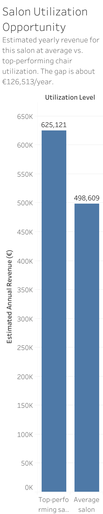

# Project | Capstone | Round 1 | Dashboard Documentation

**Purpose:** market-validation dashboard for the pitch to Chleo. It follows the consulting story arc: the size of the market, what it's worth to this salon specifically, and the evidence that the opportunity is real. Built from sourced sector research (`research/sector_research.md`), not from the salon's own operational data (which doesn't exist yet, that's the Round 2/pilot dashboard).

**Tool:** Tableau Public
**Data:** five CSVs in this folder, each mapped to one chart below
**File:** `dashboard.twbx` (open in Tableau Public or Tableau Desktop to view and interact with the live dashboard)

## How to Navigate

Read the dashboard left to right, top to bottom, it follows one story:
1. **Market Size** (top left): how big the opportunity is, narrowed down to what this salon actually needs.
2. **Salon Industry Revenue** (top right): proof the market is consolidating, not shrinking.
3. **Haircut Prices vs. Inflation** (middle left): why the opportunity is worth more every year.
4. **Salon Utilization Opportunity** (middle right): what that opportunity is worth in euros, for this salon specifically.
5. **Most Salons vs. Top Performing Salons** (bottom): proof the gap is achievable, not hypothetical.

## Chart 1: Market Size (TAM, SAM, SOM)
**File:** `01_tam_sam_som.csv`
**Chart type:** Funnel or bar, Stage vs. client count
**Source:** Amt für Statistik Berlin-Brandenburg (TAM); modeled estimate from `research/external/Market Data Sheet | Premium Independent Hair Salon, Prenzlauer Berg, Berlin.md`, Section A (SAM, SOM)
**Story:** Berlin has 3.7 million residents (TAM), but this salon doesn't need the whole city. An estimated 20,000-60,000 people are realistic premium clients (SAM), and this salon only needs about 1,700-2,300 active clients to run at 82% utilization (SOM). The salon isn't chasing a giant market, it needs a small, specific slice of it.

## Chart 2: What Utilization Is Worth to This Salon
**File:** `02_salon_utilization_opportunity.csv`
**Chart type:** Bar chart, two bars (average vs. top-performing utilization)
**Source:** Built from this salon's own rate (€102/hour, the average of the Short, Mid, and Longer/Fuller cut prices in `research/Salon Pricing.md`) and capacity (152 chair-hours/week, 48 weeks/year), applied to the industry utilization gap in `04_operational_benchmark_gaps.csv`
**Story:** At average utilization (67%), this salon's illustrative annual service revenue is about €498,609. At top-performer utilization (84%), it's about €625,121. That's a €126,513/year gap between doing this the average way and doing it well. This is a planning estimate, not a measured number. Two of the salon's 4 chairs are rented and priced independently by the renters, so this simplifies to one flat rate.

## Chart 3: Price Increases vs. General Inflation (2024)
**File:** `03_price_increase_vs_inflation_2024.csv`
**Chart type:** Bar chart, Category vs. % increase
**Source:** Statistisches Bundesamt / Branchenbericht 2024/2025
**Story:** Haircut prices rose faster (4.0-4.2%) than general inflation (2.2%) in 2024. Salons have real pricing power, which raises the cost of every lost chair-hour (no-show, unfilled slot) since each hour is worth more every year.

## Chart 4: Operational Benchmark Gaps
**File:** `04_operational_benchmark_gaps.csv`
**Chart type:** Bar chart, Metric vs. Average and Top Performer
**Source:** Zenoti 2025 Beauty & Wellness Industry Statistics (US/Canada platform benchmark, labeled as directional, not German-specific)
**Story:** Average vs. top-performer salons differ by double digits on utilization (67% vs 84%), online booking (30% vs 59%), and rebooking (10% vs 30%). This is the evidence that Chart 2's euro gap is achievable elsewhere, not hypothetical.

## Chart 5: Fewer Salons, More Revenue (2020-2023)
**File:** `05_germany_salon_revenue_trend.csv`
**Chart type:** Combo, bar (turnover) and line (registered salon count)
**Source:** Statistisches Bundesamt turnover-tax statistics and Zentralverband des Deutschen Friseurhandwerks Handwerksrollenstatistik, both via Branchenbericht 2024/2025
**Story:** From 2020 to 2023, the number of registered salons in Germany kept drifting down (80,989 to 80,476), while sector revenue climbed back up to €7.49bn. Both facts are shown together in this one chart, not just claimed separately: the market is consolidating value into fewer, more productive locations. Supporting evidence for Chart 1's point: growth comes from doing more with what you have, not from a bigger market. Limited to 2020-2023 because that's the range where both datasets overlap.

## Honesty Note for the Presentation

Charts 3 and 5 are Germany-specific and well-sourced (official statistics office / trade association data). Chart 4 is US/Canada platform data, flagged clearly as directional. Chart 1's SAM and SOM figures, and Chart 2's revenue estimates, are modeled planning assumptions built from this salon's own facts, not measured numbers, and are labeled as such on the chart and in the narration.

The labor market risk (sector employment shrinking, Berlin's apprentice pipeline moving backward while the national trend improves) is real and documented in `research/opportunities_risks.md`, but doesn't have its own chart, it supports one line in the pitch narration: none of the proposed use cases require hiring.

**Note on Chart 2's figures vs. the Market Data Sheet:** `research/external/Market Data Sheet | Premium Independent Hair Salon, Prenzlauer Berg, Berlin.md` has its own scenario table using a rounder €95/hr planning figure, giving different euro totals than this chart. This dashboard supersedes that with the salon's actual menu average (€102/hr, from `research/Salon Pricing.md`), so the two aren't meant to match, the Market Data Sheet's figures are an earlier, rougher pass.
